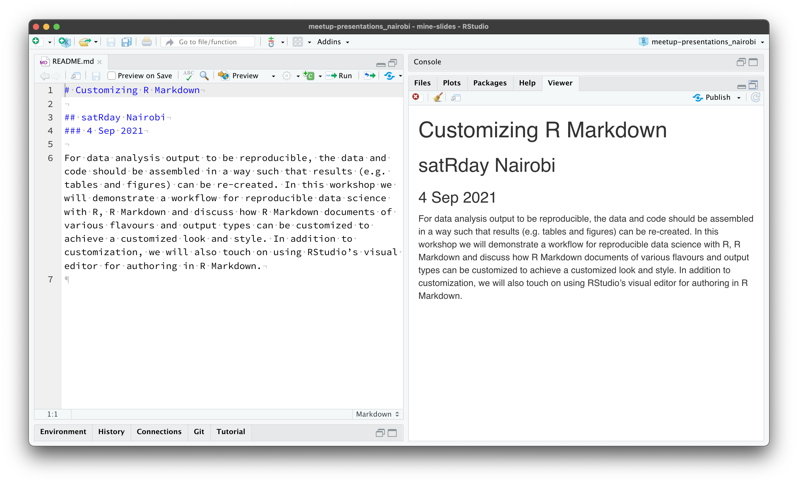
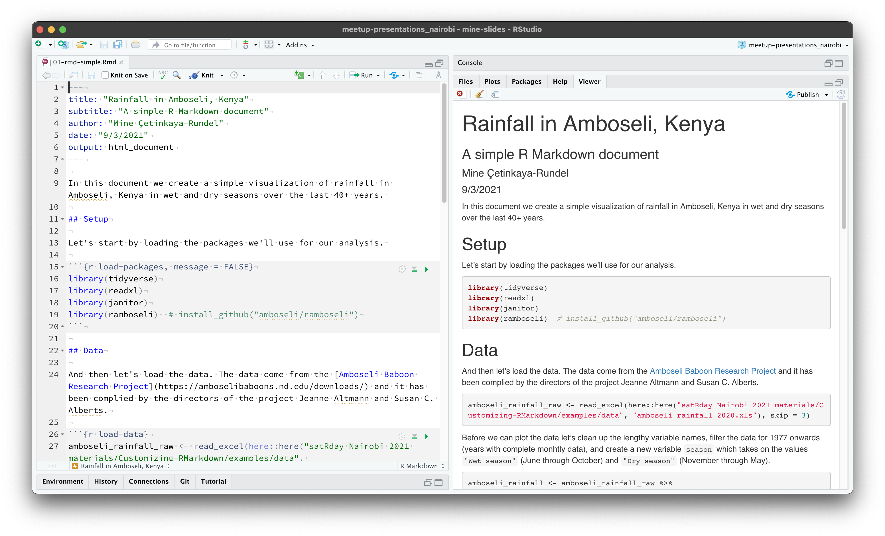
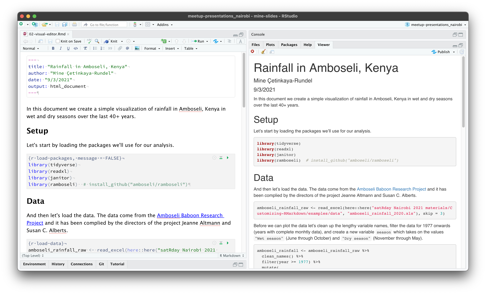
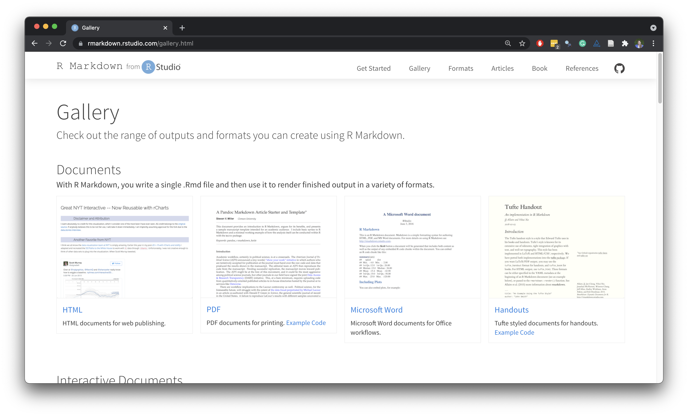
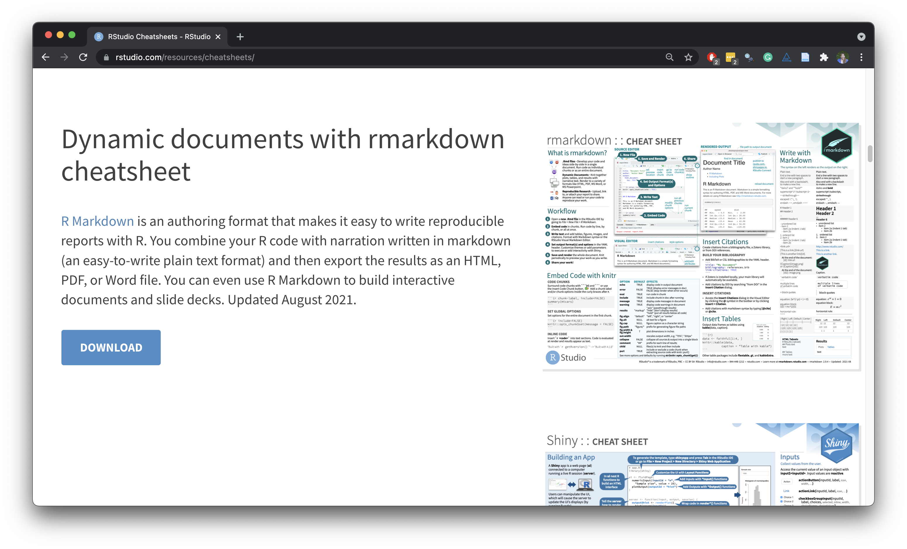

```{r setup, include=FALSE}
options(htmltools.dir.version = FALSE)
knitr::opts_chunk$set(
  fig.width = 8, fig.asp = 0.618, fig.retina = 3, dpi = 300,
  out.width = "90%",
  cache = FALSE,
  echo = TRUE,
  message = FALSE, 
  warning = FALSE,
  hiline = TRUE
)
```

```{r include=FALSE, warning=FALSE}
# color palette
library(ramboseli)
library(tidyverse)
amboseli_palette <- data.frame(matrix(amboseli_palettes$div_earthsky[[5]], nrow = 1))
names(amboseli_palette) <- c("darkblue", "lightblue", "cream", "lightbrown", "darkbrown")
```

```{r xaringan-themer, include=FALSE, warning=FALSE}
library(xaringanthemer)
style_duo_accent(
  primary_color = amboseli_palette$darkblue,
  secondary_color = amboseli_palette$lightblue,
  inverse_header_color = amboseli_palette$cream,
  black_color = amboseli_palette$darkbrown,
  header_font_google = google_font("Atkinson Hyperlegible"),
  text_font_google   = google_font("Atkinson Hyperlegible", "300", "300i"),
  code_font_google   = google_font("Source Code Pro"),
  title_slide_background_color = "#FFFFFF",
  title_slide_background_image = "images/amboseli-bg.jpeg",
  title_slide_background_size = "cover",
  title_slide_text_color = "#FFFFFF",
  base_font_size = "24px",
  extra_css = list(
    "h1" = list("margin-block-start" = "0.4rem", 
                 "margin-block-end" = "0.4rem"),
    "h2" = list("margin-block-start" = "0.4rem", 
                 "margin-block-end" = "0.4rem"),
    "h3" = list("margin-block-start" = "0.4rem", 
                 "margin-block-end" = "0.4rem"),
    ".brown" = list("color" = "#573314"),
    ".small" = list("font-size" = "90%"),
    ".midi" = list("font-size" = "150%"),
    ".large" = list("font-size" = "300%"),
    ".xlarge" = list("font-size" = "600%"),
    ".hand" = list("font-family" = "'Gochi Hand', cursive",
                   "font-size" = "150%"),
    ".task" = list("padding-right"    = "10px",
                   "padding-left"     = "10px",
                   "padding-top"      = "3px",
                   "padding-bottom"   = "3px",
                   "margin-bottom"    = "6px",
                   "margin-top"       = "6px",
                   "border-left"      = "solid 5px #F1DE67",
                   "background-color" = "#F1DE6750")
    )
  )
```

class: middle, inverse

# R ❤️ Markdown sitting in a tree

# K-I-S-S-I-N-G

---

## What is Markdown?

- Lightweight markup language with plain text formatting syntax

- Designed so that it can be converted to HTML (and many other formats)

```{r echo = FALSE, fig.alt = "On the left, a README written in markdown. On the right, the rendered version in HTML."}

```

---

## What is R Markdown?

- Markdown + R

- Text + R code (in chunks) gets converted to text + R code + R output in HTML (and many other formats)

```{r echo = FALSE, fig.alt = "On the left, an R Markdown file. On the right, the rendered version in HTML."}

```

---

background-image: url("images/amboseli-land.jpeg")
background-size: cover

## demo: `01-rmd-simple.Rmd`

<br><br><br><br><br>

.midi[
.hand[follow along at] [rstd.io/rmd-custom-cloud](https://rstd.io/rmd-custom-cloud)
]

---

class: middle, inverse

# Aside: Visual editor

---

## Visual editor

.pull-left[
- Visual editing for all of text, tables, lists, etc.
- Support for citations
- Cross-refs, footnotes, equations, LaTeX
]
.pull-right[
- Real time spell-checking, outline navigation
- Tight integration with source editing
- Insert anything with catch-all `⌘ /` shortcut
]

```{r echo = FALSE, fig.alt = "On the left, R Markdown file opened with the visual editor. On the right, the rendered version in HTML."}

```

---

background-image: url("images/amboseli-land.jpeg")
background-size: cover

## demo: `02-visual-editor.Rmd`

<br><br><br><br><br>

.midi[
.hand[follow along at] [rstd.io/rmd-custom-cloud](https://rstd.io/rmd-custom-cloud)
]

---

class: middle, inverse

# Customizing .brown[chunk options]

---

## Show / hide

- `message = FALSE` and `warning = FALSE` to suppress messages and warnings (with caution!)
- `error = TRUE` to knit despite an error
- `include = FALSE` to run, but hide output, messages, warnings, etc.

---

## Chunk options for figures

- Recommended chunk options:
  - `fig.retina = 3`
  - `out.width = "70%"`
  - `fig.width = 6`
  - `fig.asp = 0.618`
  - `fig.alt`: Alternative text
- More on this:
  - [R for Data Science - Graphics for communication](https://r4ds.had.co.nz/graphics-for-communication.html)
  - [Tips and tricks for working with images and figures in R Markdown documents](https://www.zevross.com/blog/2017/06/19/tips-and-tricks-for-working-with-images-and-figures-in-r-markdown-documents/)

---

## Setting global options

```{r eval = FALSE}
knitr::opts_chunk$set(
  fig.retina = 3,
  out.width = "70%",
  fig.width = 6,
  fig.asp = 0.618
)
```

---

background-image: url("images/amboseli-land.jpeg")
background-size: cover

## demo: `03-chunk-options.Rmd`

<br><br><br><br><br>

.midi[
.hand[follow along at] [rstd.io/rmd-custom-cloud](https://rstd.io/rmd-custom-cloud)
]

---

class: middle, inverse

# Customizing .brown[output]

---

## Same input, different outputs

with a simple change in the YAML

```{r eval = FALSE}
output: html_document
output: pdf_document
output: word_document
output: tufte::tufte_html
...
```

---

background-image: url("images/amboseli-land.jpeg")
background-size: cover

## demo: `04-outputs.Rmd`

<br><br><br><br><br>

.midi[
.hand[follow along at] [rstd.io/rmd-custom-cloud](https://rstd.io/rmd-custom-cloud)
]

---

class: middle, inverse

# Customizing .brown[theme]

---

## Change output options

```{r echo = FALSE, fig.alt = "Edit R Markdown document options window."}

```

---

## bslib & thematic

- [**bslib**](https://rstudio.github.io/bslib/): Tools for customizing [Bootstrap themes](https://getbootstrap.com/docs/4.6/getting-started/theming/) directly from R, making it much easier to customize the appearance of Shiny apps & R Markdown documents

- [**thematic**](https://rstudio.github.io/thematic/): Simplified theming of ggplot2, lattice, and base R graphics, automatically styled in R Markdown documents (and Shiny apps, and in the RStudio IDE)

---

background-image: url("images/amboseli-land.jpeg")
background-size: cover

## demo: `05-theme.Rmd`

<br><br><br><br><br>

.midi[
.hand[follow along at] [rstd.io/rmd-custom-cloud](https://rstd.io/rmd-custom-cloud)
]

---

class: middle, inverse

# Customizing .brown[format]

---

## Same-ish source, different format

Using R Markdown, you can write

- books: **bookdown**
- websites: **blogdown**, **distill**, **pkgdown**
- slide decks: **xaringan**
- dashboards: **flexdashboard**
- ...

---

background-image: url("images/amboseli-land.jpeg")
background-size: cover

## demo: `06-xaringan.Rmd`

<br><br><br><br><br>

.midi[
.hand[follow along at] [rstd.io/rmd-custom-cloud](https://rstd.io/rmd-custom-cloud)
]

---

class: middle, inverse

# Learn .brown[more]

---

.center[
.midi[
[rmarkdown.rstudio.com/gallery.html](https://rmarkdown.rstudio.com/gallery.html)
]
]

```{r echo = FALSE, fig.align = "center", fig.alt = "R Markdown Gallery."}

```

---

.center[
.midi[
[rstudio.com/resources/cheatsheets/](https://www.rstudio.com/resources/cheatsheets/)
]
]

```{r echo = FALSE, fig.align = "center", fig.alt = "R Markdown cheat sheet."}

```

---

## Acknowledgements

- RStudio R Markdown team + community
- RStudio cheat sheets intern Averi Perny
- Fernando Campos for the [**ramboseli**](https://github.com/amboseli/ramboseli) package (and Jenny Tung for the pointer!)

---

class: middle, inverse

.center[
.large[
.hand[
thank you! <br><br> [rstd.io/rmd-custom](https://rstd.io/rmd-custom)
]
]
]